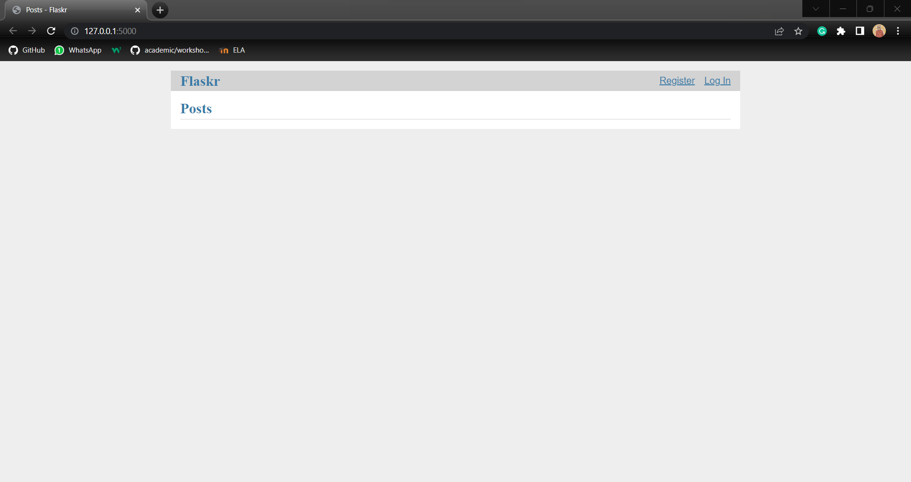

# Minggu 11

## Pemrograman Web

### Installasi Flask

Lakukan instalasi flask dengan clone repository dari flask berikut :

```
# clone the repository
$ git clone https://github.com/pallets/flask
$ cd flask
# checkout the correct version
$ git tag  # shows the tagged versions
$ git checkout 2.3.2
$ cd examples/tutorial
```

Buatlah virtual environment dan aktifkan :

```
$ py -3 -m venv .venv
$ .venv\Scripts\activate.bat
```

Install Flask :

```
$ pip install -e .
```

Untuk run aplikasi gunakan command berikut :

```
$ flask --app flaskr init-db
$ flask --app flaskr run --debug
```

Bukalah http://127.0.0.1:5000 pada browser

Tampilan :


