# 5. Struktur Data

## 5.1 More on List

Berikut beberapa metode objek list :

- list.**append**(x)
  > Menambah item pada akhir list
- list.**extend**(iterable)
  > Perpanjang list dengan menambahkan semua item dari iterable.
- list.**insert**(i, x)
  > Menambahkan item pada posisi yang ditentukan. Argumen pertama adalah index posisi yang akan ditambahkan.
- list.**remove**(x)
  > Hapus item pertama dari list yang bernilai x. Itu memunculkan ValueError jika tidak ada item seperti itu.
- list.**pop**([i])
  > Hapus item pada posisi yang diberikan dalam list, dan return. Jika tidak ada indeks yang ditentukan, a.pop() menghapus dan mengembalikan item terakhir dalam list.
- list.**clear**()
  > Hapus semua item dari list
- list.**index**(x[, start[, end]])
  > Kembalikan indeks berbasis nol dalam list item pertama yang nilainya sama dengan x. Menimbulkan ValueError jika tidak ada item tersebut
- list.**count**(x)
  > Mengembalikan nilai berapa kali x muncul
- list.**reverse**()
  > Membalik elemen pada list
- list.**copy**()
  > Mengembalikan nilai copy dari list

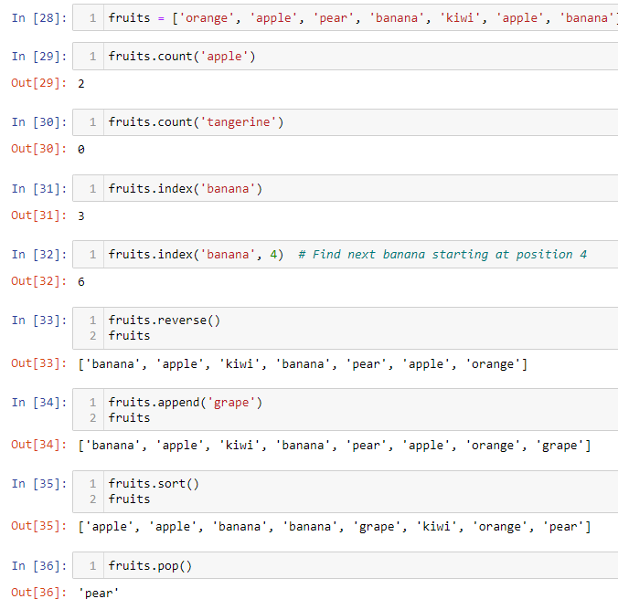

### 5.1.1 Using list as Stacks

Metode list membuatnya sangat mudah untuk menggunakan list sebagai tumpukan, di mana elemen terakhir yang ditambahkan adalah elemen pertama yang diambil (“last-in, first-out”). Untuk menambahkan item ke bagian atas tumpukan, gunakan append(). Untuk mengambil item dari atas tumpukan, gunakan pop() tanpa indeks eksplisit. Misalnya:


### 5.1.2 Using Lists as Queues

Dimungkinkan juga untuk menggunakan list sebagai antrian, di mana elemen pertama yang ditambahkan adalah elemen pertama yang diambil (“first-in, first-out”); namun, list tidak efisien untuk tujuan ini. Sementara menambahkan dan muncul dari akhir list terbilang cepat, melakukan sisipan atau muncul dari awal list terbilang lambat

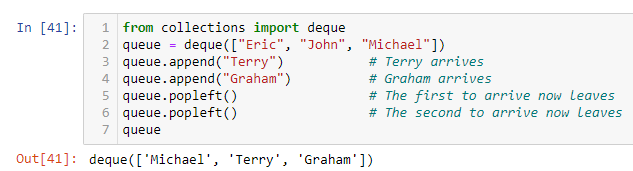

### 5.1.3 List Comprehensions

Pemahaman list menyediakan cara ringkas untuk membuat list. Aplikasi umum adalah membuat list baru di mana setiap elemen adalah hasil dari beberapa operasi yang diterapkan ke setiap anggota urutan lain atau iterable, atau untuk membuat urutan elemen yang memenuhi kondisi tertentu.

Sebagai contoh, asumsikan kita ingin membuat list kuadrat :


Perlu diingat bahwa ini membuat (atau menimpa) sebuah variabel bernama x yang masih ada saat loop selesai. Kita dapat menghitung kuadrat tanpa efek samping menggunakan :

```Python
squares = list(map(lambda x: x**2, range(0)))
```

atau menggunakan :

```Python
squares = [x**2 for x in range(10)]
```

yang mana lebih ringkas dan mudah dibaca

### 5.1.4 Nested List Comprehensions

Ekspresi awal dalam pemahaman list dapat berupa sembarang ekspresi, termasuk pemahaman daftar lainnya.

Pertimbangkan contoh matriks 3x4 berikut yang diimplementasikan sebagai list :

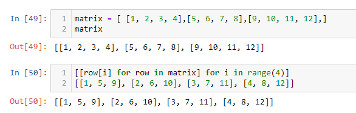

List comprehension berikut akan transpose row dan column :

```Python
>>> [[row[i] for row in matrix] for i in range(4)]
[[1, 5, 9], [2, 6, 10], [3, 7, 11], [4, 8, 12]]
```

Seperti yang kita lihat di bagian sebelumnya, pemahaman inner list dievaluasi dalam konteks for yang mengikutinya, jadi contoh ini setara dengan:

```Python
>>> transposed = []
>>> for i in range(4):
...    transposed.append([row[i] for row in matrix])
...
>>> transposed
[[1, 5, 9], [2, 6, 10], [3, 7, 11], [4, 8, 12]]
```

Yang juga sama dengan :

```Python
>>> transposed = []
>>> for i in range(4):
...    # the following 3 lines implement the nested listcomp
...    transposed_row = []
...    for row in matrix:
...        transposed_row.append(row[i])
...    transposed.append(transposed_row)
...
>>> transposed
[[1, 5, 9], [2, 6, 10], [3, 7, 11], [4, 8, 12]]
```

Di dunia nyata, Anda harus memilih fungsi bawaan daripada pernyataan alur yang kompleks. Fungsi zip() akan bekerja dengan baik untuk kasus penggunaan ini:

```Python
>>> list(zip(*matrix))
[(1, 5, 9), (2, 6, 10), (3, 7, 11), (4, 8, 12)]
```

## 5.2 The del statement

Ada cara untuk menghapus item dari list yang diberikan indeksnya alih-alih nilainya: pernyataan del. Ini berbeda dari metode pop() yang mengembalikan nilai. Pernyataan del juga dapat digunakan untuk menghapus irisan dari list atau menghapus seluruh list (yang kita lakukan sebelumnya dengan menugaskan daftar kosong ke irisan). Misalnya:

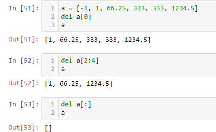

**del** juga bisa digunakan untuk menghapus seluruh variabel :

```Python
>>> del a
```

## 5.3 Tuples and Sequences

Dapat kita lihat bahwa list dan string memiliki banyak properti yang sama, seperti operasi pengindeksan dan pemotongan.

Sebuah tuple terdiri dari sejumlah nilai yang dipisahkan dengan koma, misalnya:

```Python
>>> t = 12345, 54321, 'hello!'
>>> t[0]
12345
>>> t
(12345, 54321, 'hello!')
>>> # Tuples may be nested:
... u = t, (1, 2, 3, 4, 5)
>>> u
((12345, 54321, 'hello!'), (1, 2, 3, 4, 5))
>>> # Tuples are immutable:
... t[0] = 88888
Traceback (most recent call last):
  File "<stdin>", line 1, in <module>
TypeError: 'tuple' object does not support item assignment
>>> # but they can contain mutable objects:
... v = ([1, 2, 3], [3, 2, 1])
>>> v
([1, 2, 3], [3, 2, 1])
```

Masalah khusus adalah pembuatan tupel yang berisi 0 atau 1 item: sintaks memiliki beberapa keanehan tambahan untuk mengakomodasi ini. Tupel kosong dibangun oleh sepasang tanda kurung kosong; tuple dengan satu item dibangun dengan mengikuti nilai dengan koma (tidak cukup untuk menyertakan satu nilai dalam tanda kurung). Jelek, tapi efektif. Misalnya:

```Python
>>> empty = ()
>>> singleton = 'hello',    # <-- note trailing comma
>>> len(empty)
0
>>> len(singleton)
1
>>> singleton
('hello',)
```

## 5.4 Sets

Python juga menyertakan tipe data untuk set. Himpunan adalah koleksi tak terurut tanpa elemen duplikat. Penggunaan dasar termasuk pengujian keanggotaan dan menghilangkan entri duplikat. Set objek juga mendukung operasi matematika seperti penyatuan, persimpangan, perbedaan, dan perbedaan simetris

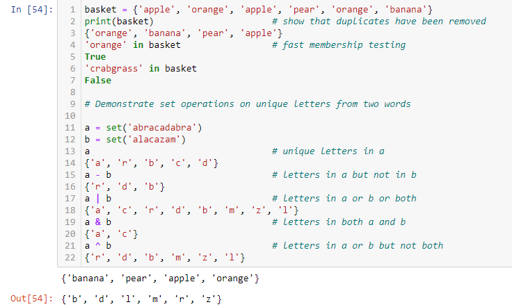

Seperti list comprehension, set comprehension juga dapat melakukan :

```Python
>>> a = {x for x in 'abracadabra' if x not in 'abc'}
>>> a
{'r', 'd'}
```

## 5.5 Dictionaries

Tipe data built-in berguna lainnya yaitu dictionaries. Dictionaries kadang-kadang ditemukan dalam bahasa lain sebagai "associative memories" or "associative arrays". Tidak seperti urutan, yang diindeks oleh rentang angka, kamus diindeks oleh kunci, yang dapat berupa tipe apa pun yang tidak dapat diubah; string dan angka selalu bisa menjadi kunci.

Berikut contoh menggunakan dictionaries :

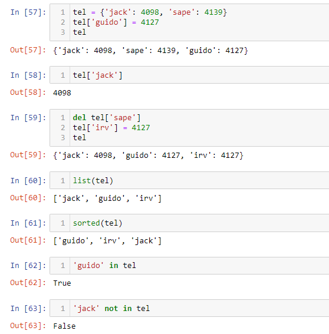

**dict()** constructor membangun dictionaries langsung dari sequence dari key-value pairs :

```Python
>>> dict([('sape', 4139), ('guido', 4127), ('jack', 4098)])
{'sape': 4139, 'guido': 4127, 'jack': 4098}
```

Selain itu, pemahaman dict dapat digunakan untuk membuat kamus dari ekspresi kunci dan nilai arbitrer:

```Python
>>> {x: x**2 for x in (2, 4, 6)}
{2: 4, 4: 16, 6: 36}

```

Saat keys berupa string sederhana, terkadang lebih mudah untuk menentukan pasangan menggunakan argumen kata kunci:

```Python
>>> dict(sape=4139, guido=4127, jack=4098)
{'sape': 4139, 'guido': 4127, 'jack': 4098}
```

## 5.6 Looping Technique

Saat looping melalui dictionaris, key dan nilai yang sesuai dapat diambil pada saat yang sama menggunakan metode items().

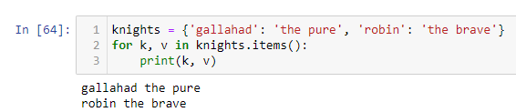

Saat mengulang urutan, indeks posisi dan nilai terkait dapat diambil pada saat yang sama menggunakan fungsi enumerate().

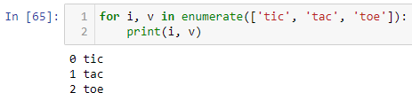

Untuk mengulangi dua urutan atau lebih pada saat yang sama, entri dapat dipasangkan dengan fungsi zip().

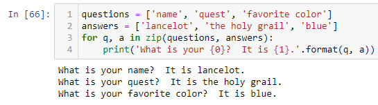

Untuk mengulangi urutan secara terbalik, pertama tentukan urutan dalam arah maju dan kemudian panggil fungsi reversed().

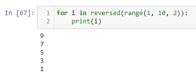

Untuk mengulangi urutan dalam urutan terurut, gunakan fungsi sorted() yang mengembalikan daftar terurut baru sambil membiarkan sumbernya tidak berubah.

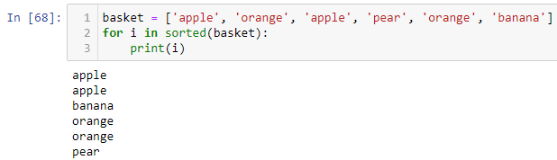

Menggunakan set() pada urutan menghilangkan elemen duplikat. Penggunaan sortir() dalam kombinasi dengan set() di atas urutan adalah cara idiomatis untuk mengulang elemen unik dari urutan dalam urutan terurut.

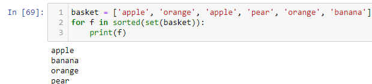

Terkadang tergoda untuk mengubah daftar saat Anda mengulanginya; namun, seringkali lebih mudah dan lebih aman untuk membuat daftar baru.

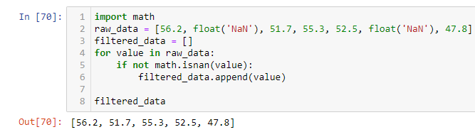

## 5.7 More on Conditions

Kondisi yang digunakan dalam pernyataan while dan if dapat berisi operator apa saja, bukan hanya perbandingan.

Operator pembanding in dan not in adalah uji keanggotaan yang menentukan apakah suatu nilai ada di dalam (atau tidak di dalam) wadah. Operator adalah dan tidak membandingkan apakah dua objek benar-benar objek yang sama. Semua operator pembanding memiliki prioritas yang sama, yang lebih rendah dari semua operator numerik.

Perbandingan dapat dirantai. Misalnya, a < b == c menguji apakah a kurang dari b dan terlebih lagi b sama dengan c.

Perbandingan dapat digabungkan menggunakan operator Boolean dan dan atau, dan hasil perbandingan (atau ekspresi Boolean lainnya) dapat ditiadakan dengan not. Ini memiliki prioritas lebih rendah daripada operator pembanding; di antara mereka, tidak memiliki prioritas tertinggi dan atau terendah, sehingga A dan bukan B atau C setara dengan (A dan (bukan B)) atau C. Seperti biasa, tanda kurung dapat digunakan untuk menyatakan komposisi yang diinginkan.

Operator Boolean dan dan atau disebut operator hubung singkat: argumen mereka dievaluasi dari kiri ke kanan, dan evaluasi berhenti segera setelah hasilnya ditentukan. Misalnya, jika A dan C benar tetapi B salah, A dan B dan C tidak mengevaluasi ekspresi C. Ketika digunakan sebagai nilai umum dan bukan sebagai Boolean, nilai kembalian dari operator hubung singkat adalah yang terakhir argumen yang dievaluasi.

Dimungkinkan untuk menetapkan hasil perbandingan atau ekspresi Boolean lainnya ke variabel. Misalnya :

```Python
>>> string1, string2, string3 = '', 'Trondheim', 'Hammer Dance'
>>> non_null = string1 or string2 or string3
>>> non_null
'Trondheim'
```

## 5.8 Comparing Sequence and Other Types

Objek urutan biasanya dapat dibandingkan dengan objek lain dengan tipe urutan yang sama. Perbandingannya menggunakan urutan leksikografis: pertama dua item pertama dibandingkan, dan jika berbeda, ini menentukan hasil perbandingan; jika sama, dua item berikutnya dibandingkan, dan seterusnya, sampai salah satu urutannya habis. Jika dua item yang akan dibandingkan itu sendiri adalah urutan dari jenis yang sama, perbandingan leksikografis dilakukan secara rekursif. Jika semua item dari dua urutan sebanding, urutannya dianggap sama. Jika satu urutan adalah sub-urutan awal dari yang lain, urutan yang lebih pendek adalah yang lebih kecil (lebih kecil). Pengurutan leksikografis untuk string menggunakan nomor poin kode Unicode untuk mengurutkan karakter individual. Beberapa contoh perbandingan antar barisan yang sejenis:

```Python
(1, 2, 3)              < (1, 2, 4)
[1, 2, 3]              < [1, 2, 4]
'ABC' < 'C' < 'Pascal' < 'Python'
(1, 2, 3, 4)           < (1, 2, 4)
(1, 2)                 < (1, 2, -1)
(1, 2, 3)             == (1.0, 2.0, 3.0)
(1, 2, ('aa', 'ab'))   < (1, 2, ('abc', 'a'), 4)
```
